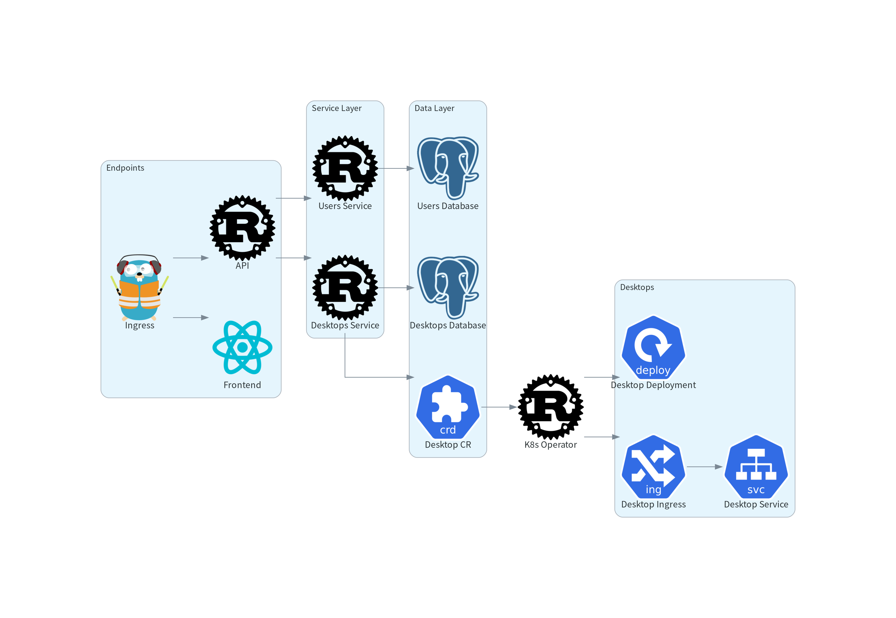

# Architectural Overview

KubePods relies on a microservices architecture in which each service has a specific role.
- The Traefik reverse proxy handles incoming HTTP requests and redirects them to the corresponding service. It also provides caching, performance optimizations, and SEO-related features.
- The frontend uses NGINX to serve statically compiled React web pages in production. It also uses React Router as a routing library rather than a framework-based routing solution.
- The API relies on Axum to handle incoming HTTP requests and on Tonic for gRPC communication with services. It also handles JWT authentication.
- The Users service uses Tonic to handle gRPC requests. It manages user-related operations, including authentication.
- The Desktops service also uses Tonic to handle gRPC requests and manages desktop-related operations, including provisioning.
- The Kubernetes Operator is a custom operator that relies on the Rust Kube library to communicate with the cluster API and provision desktop infrastructure. It continuously watches Desktop custom resources and provisions their infrastructure through a reconciliation loop, preventing configuration drift.

# Installation

<Cards>
<Card href="/docs/runbooks/installation/dev" title="Dev environment">
  KubePods installation in a developement environment
</Card>
<Card href="/docs/runbooks/installation/staging" title="Staging environment">
  KubePods installation in a staging environment
</Card>
</Cards>
